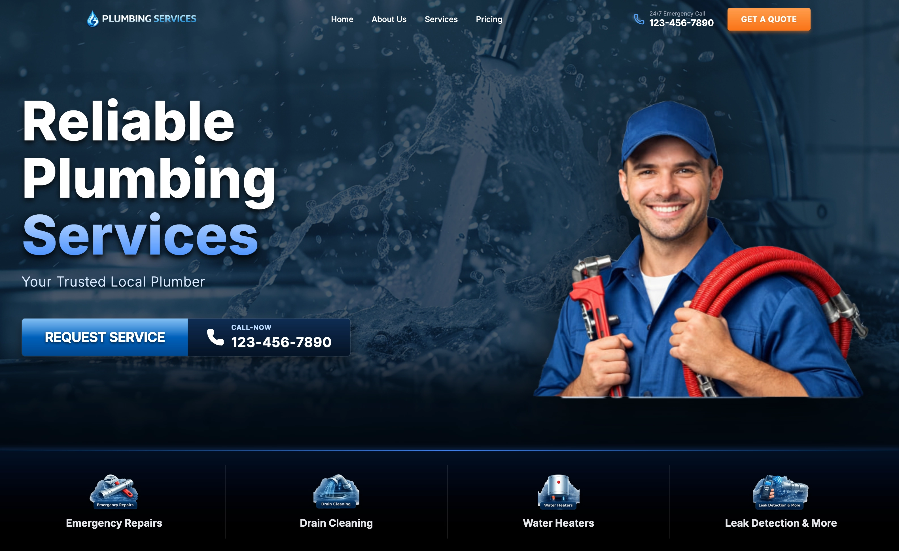

# 🚰 Reliable Plumbing Services Landing Page


<div align="center">

[](https://react.dev/)
[](https://vitejs.dev/)
[](https://www.typescriptlang.org/)
[](https://tailwindcss.com/)
[](https://www.framer.com/motion/)

**A high-performance, modern landing page for plumbing services.**
*Fully Responsive • Glassmorphism UI • Next-Gen Tech Stack*

[View Demo](https://plumbing-landing-coral.vercel.app/) · [Report Bug](https://github.com/livadin/plumbing-landing/issues) · [Request Feature](https://github.com/livadin/plumbing-landing/issues)

</div>

---

## 📄 Overview

This project is a showcase of a robust, production-ready landing page tailored for the service industry. It leverages the cutting-edge capabilities of **React 19** and the newly released **Tailwind CSS v4** (Oxide engine) to deliver lightning-fast performance and a seamless user experience.

The design philosophy centers on **trust and professionalism**, utilizing a deep navy palette, parallax effects, and glassmorphism elements to create an immersive interface.

## ✨ Key Features

### 🎨 UI/UX Excellence
* **Immersive Hero Section:** Features a multi-layered parallax background with gradient overlays for visual depth.
* **Glassmorphism Navigation:** A responsive navbar with backdrop blur effects that transitions smoothly on scroll.
* **Interactive Elements:** Custom "glossy" buttons with sophisticated hover states and gradient fills.
* **Smooth Animations:** Powered by `Framer Motion` for staggered entry effects and seamless transitions.
* **Fully Responsive:** Optimized layouts for all viewports, from 4K desktops to mobile devices.

### 🛠 Technical Highlights
* **React 19:** Built on the latest React core for improved rendering performance.
* **Tailwind CSS v4:** Utilizes the new zero-runtime engine for instant build times and modern CSS features.
* **TypeScript:** Strictly typed codebase ensures reliability and maintainability.
* **Vite:** Blazing fast development server and optimized production builds.

## 📸 Screenshots

| Desktop Experience | Mobile Interface |
|:---:|:---:|
|  |  |

## 🚀 Getting Started

Follow these steps to set up the project locally.

### Prerequisites
* Node.js (v18 or higher)
* npm or yarn

### Installation

1.  **Clone the repository**
    ```bash
    git clone https://github.com/livadin/plumbing-landing.git
    cd plumbing-landing
    ```

2.  **Install dependencies**
    ```bash
    npm install
    # or
    yarn install
    ```

3.  **Start the development server**
    ```bash
    npm run dev
    ```
    The application will be available at `http://localhost:5173`.

## 📂 Project Structure

```text
src/
├── components/          # Reusable UI components
│   ├── buttons/         # Atomic button components (e.g., ServiceButton)
│   ├── Hero.tsx         # Main landing area with parallax effects
│   ├── Navbar.tsx       # Responsive navigation with mobile drawer
│   └── Services.tsx     # Services grid section
├── App.tsx              # Root component layout
├── index.css            # Global styles & Tailwind v4 configuration
└── main.tsx             # Application entry point
 ```

## 👤 Author
1.  **GitHub: [livadin](https://github.com/livadin)**

2.  **LinkedIn: [Danylo Vilchauskas](https://www.linkedin.com/in/danylo-vilchauskas-64019530a/)**